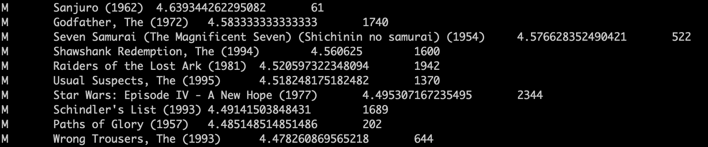
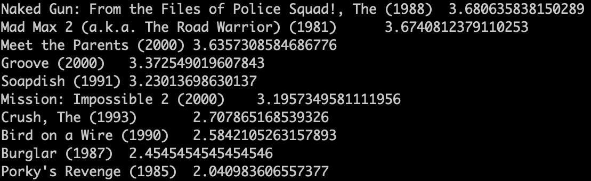

# HIVE

## 展示电影 ID 为 2116 这部电影各年龄段的平均影评分

 \
[sql](./3_query_avg_age.sql)

```sql
SELECT t.age AS age, avg(t.rate) as avgrate
FROM (SELECT t_user.age, t_rating.rate
      FROM t_rating
               JOIN t_user on (t_rating.userid == t_user.userid)
      WHERE t_rating.movieid==2116) t
GROUP BY t.age
ORDER BY t.age;
```

針對相同的 userid 以及 movieid 2116, join 兩張表, 對年齡段 Group, 後利用 avg 計算平均, 在對 age 排序

## 找出男性评分最高且评分次数超过 50 次的 10 部电影，展示电影名，平均影评分和评分次数。



[sql](./4_query_male_top_10_movies.sql)

```sql
SELECT t_user.sex as sex, t_movie.moviename as name, avg(t_rating.rate) as avgrate, count(*) as total
FROM t_rating
         JOIN t_user on (t_rating.userid == t_user.userid and t_user.sex == 'M')
         JOIN t_movie on (t_rating.movieid == t_movie.movieid)
GROUP BY t_movie.movieid, t_user.sex, t_movie.moviename
HAVING count(*) > 50
ORDER BY avgrate DESC limit 10;
```

針對男性且相同 userid 和 movideid, join 三表, 對 movieid, sex, moviename 做 Group by , 利用 having 過濾掉評分次數小於等於 50 的 record,
計算平均後對平均影評分做大到小排序, 取 10 個 record

### 找出影评次数最多的女士所给出最高分的 10 部电影的平均影评分，展示电影名和平均影评分（可使用多行 SQL）。

\
[sql](./5_top_10_movies_by_lady.sql)

```sql
with lady as (
    SELECT t_user.userid as userid --, count(*) as total 
    FROM t_rating
             JOIN t_user on (t_rating.userid == t_user.userid and t_user.sex == 'F')
    GROUP BY t_user.userid
    ORDER BY count(*) DESC
    limit 1)
   , top10_sort_id_desc as (
select t_movie.movieid as movieid, t_movie.moviename as moviename, t_rating.rate as rate
from t_rating
    JOIN lady
on (lady.userid == t_rating.userid)
    JOIN t_movie on (t_movie.movieid == t_rating.movieid)
ORDER BY rate, t_movie.movieid DESC
    LIMIT 10)

SELECT top10_sort_id_desc.moviename as moveiname, avg(t_rating.rate) as avgrate
FROM top10_sort_id_desc
         JOIN t_rating on (top10_sort_id_desc.movieid == t_rating.movieid)
GROUP BY top10_sort_id_desc.movieid, top10_sort_id_desc.moviename
ORDER BY avgrate DESC;
```

由於 hive 不支援 set lady = select .... , 利用 CTE
1. 第一個 CTE, 基於 user.sex, join user和rating, 對女士的 userid 做group後, 排序第一個即是女士
2. 第二個 CTE, 基於 userid 找出 rating 中的紀錄, 對 movieid 大到小排序後取出前10
3. 在基於 movieid 做 Group 計算 avg