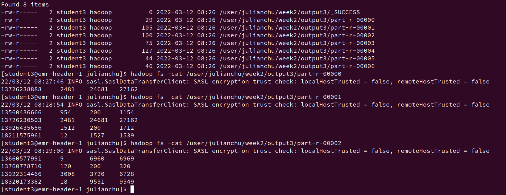

# mapreduceHW


build jar\
`mvn package`\
copy jar to remote server\
`scp <local folder> account@remoteaddr:<remote folder>`\
create directory in HDFS\
`hadoop fs -mkdir -p /julianchu/mapreduce/input`\
copy file to hdfs\
`hadoop fs -put ./HTTP_20130313143750.dat  /julianchu/mapreduce/input`\
execute jar\
`hadoop jar mapreduce-1.0.jar MobileMapReduce /julianchu/mapreduce/input/HTTP_20130313143750.dat /julianchu/mapreduce/output`\
```shell
22/04/02 05:35:46 INFO mapreduce.Job: Counters: 55
	File System Counters
		FILE: Number of bytes read=641
		FILE: Number of bytes written=1944017
		FILE: Number of read operations=0
		FILE: Number of large read operations=0
		FILE: Number of write operations=0
		HDFS: Number of bytes read=2383
		HDFS: Number of bytes written=505
		HDFS: Number of read operations=38
		HDFS: Number of large read operations=0
		HDFS: Number of write operations=14
		HDFS: Number of bytes read erasure-coded=0
	Job Counters
		Killed reduce tasks=1
		Launched map tasks=1
		Launched reduce tasks=7
		Data-local map tasks=1
		Total time spent by all maps in occupied slots (ms)=92720
		Total time spent by all reduces in occupied slots (ms)=1437675
		Total time spent by all map tasks (ms)=2440
		Total time spent by all reduce tasks (ms)=19169
		Total vcore-milliseconds taken by all map tasks=2440
		Total vcore-milliseconds taken by all reduce tasks=19169
		Total megabyte-milliseconds taken by all map tasks=2967040
		Total megabyte-milliseconds taken by all reduce tasks=46005600
	Map-Reduce Framework
		Map input records=22
		Map output records=22
		Map output bytes=1072
		Map output materialized bytes=585
		Input split bytes=154
		Combine input records=0
		Combine output records=0
		Reduce input groups=21
		Reduce shuffle bytes=585
		Reduce input records=22
		Reduce output records=21
		Spilled Records=44
		Shuffled Maps =7
		Failed Shuffles=0
		Merged Map outputs=7
		GC time elapsed (ms)=451
		CPU time spent (ms)=8180
		Physical memory (bytes) snapshot=2258554880
		Virtual memory (bytes) snapshot=31002214400
		Total committed heap usage (bytes)=2619867136
		Peak Map Physical memory (bytes)=470937600
		Peak Map Virtual memory (bytes)=2952941568
		Peak Reduce Physical memory (bytes)=257605632
		Peak Reduce Virtual memory (bytes)=4007546880
	Shuffle Errors
		BAD_ID=0
		CONNECTION=0
		IO_ERROR=0
		WRONG_LENGTH=0
		WRONG_MAP=0
		WRONG_REDUCE=0
	File Input Format Counters
		Bytes Read=2229
	File Output Format Counters
		Bytes Written=505
```
merged result:\
`hadoop fs -getmerge /julianchu/mapreduce/output ./output.txt`
```shell
13726238888	27	2481	2508
13560436666	15	1116	1131
13726230503	27	2481	2508
13926435656	4	132	136
18211575961	12	1527	1539
13660577991	9	6960	6969
13760778710	2	120	122
13922314466	12	3008	3020
18320173382	18	9531	9549
13502468823	102	7335	7437
13602846565	12	1938	1950
84138413	16	4116	4132
13560439658	24	2034	2058
13925057413	63	11058	11121
15013685858	27	3659	3686
15920133257	20	3156	3176
15989002119	3	1938	1941
13719199419	0	240	240
13826544101	0	264	264
13480253104	3	180	183
13926251106	0	240	240


```
