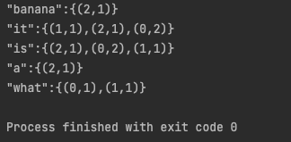

# inverted index
output

 \
/usr/local/Cellar/apache-spark/3.2.1/bin/spark-submit --master local --deploy-mode client --class SparkInvertedIndex --name spark-submit /Users/yu-langchu/Repos/bigdata_camp/spark/inverted-index/out/artifacts/inverted_index_jar/inverted-index.jar /Users/yu-langchu/Repos/bigdata_camp/spark/inverted-index/docs