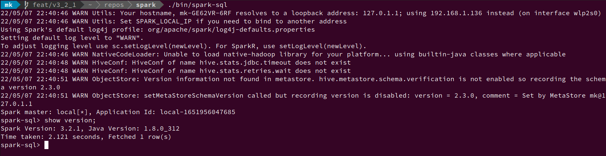

# Spark SQL Homework
## Homework1: show version

[github commit](https://github.com/Julian-Chu/spark/commit/73de375f1b55df4b13112d7b844626d411190e6f)
1. 修改 sql/catalyst/src/main/antlr4/org/apache/spark/sql/catalyst/parser/SqlBase.g4 
2. 執行 maven -> Spark Project Catalyst -> Plugins -> antlr4
3. 新增 scala code
4. 編譯命令： `build/mvn clean package -DskipTests -Phive -Phive-thriftservr`



## Homework2: optimizer rules
### 1. CombineFilters, CollapseProject、BooleanSimplification
```json
  { "ID": 1, "Name": "Max", "Amount": 1.23, "Age": 20 },
  { "ID": 2, "Name": "John", "Amount": 200.00, "Age": 15 },
  { "ID": 3, "Name": "Mary", "Amount": 106.00, "Age": 30 },
  { "ID": 4, "Name": "Ada", "Amount": 22.00, "Age": 18 }
```

in spark-sql
```sql
set spark.sql.planChangeLog.level=WARN;
CREATE TEMPORARY VIEW record USING org.apache.spark.sql.json  OPTIONS (path 'data.json');
SELECT  NewAge FROM (SELECT Age+1 as NewAge FROM (select Age FROM record WHERE Age > 15 )) WHERE NewAge > 18 AND 1=1;
```

```shell
=== Applying Rule org.apache.spark.sql.catalyst.optimizer.PushDownPredicates ===
!Filter ((NewAge#97L > cast(18 as bigint)) AND (1 = 1))         Project [(Age#34L + cast(1 as bigint)) AS NewAge#97L]
!+- Project [(Age#34L + cast(1 as bigint)) AS NewAge#97L]       +- Project [Age#34L]
!   +- Project [Age#34L]                                           +- Filter ((Age#34L > cast(15 as bigint)) AND (((Age#34L + cast(1 as bigint)) > cast(18 as bigint)) AND (1 = 1)))
!      +- Filter (Age#34L > cast(15 as bigint))                       +- Relation [Age#34L,Amount#35,ID#36L,Name#37] json
!         +- Relation [Age#34L,Amount#35,ID#36L,Name#37] json

22/05/08 00:59:37 WARN PlanChangeLogger:
=== Applying Rule org.apache.spark.sql.catalyst.optimizer.CollapseProject ===
 Project [(Age#34L + cast(1 as bigint)) AS NewAge#97L]                                                                  Project [(Age#34L + cast(1 as bigint)) AS NewAge#97L]
!+- Project [Age#34L]                                                                                                   +- Filter ((Age#34L > cast(15 as bigint)) AND (((Age#34L + cast(1 as bigint)) > cast(18 as bigint)) AND (1 = 1)))
!   +- Filter ((Age#34L > cast(15 as bigint)) AND (((Age#34L + cast(1 as bigint)) > cast(18 as bigint)) AND (1 = 1)))      +- Relation [Age#34L,Amount#35,ID#36L,Name#37] json
!      +- Relation [Age#34L,Amount#35,ID#36L,Name#37] json

..... 

22/05/08 00:59:37 WARN PlanChangeLogger:
=== Applying Rule org.apache.spark.sql.catalyst.optimizer.BooleanSimplification ===
 Project [(Age#34L + 1) AS NewAge#97L]                            Project [(Age#34L + 1) AS NewAge#97L]
!+- Filter ((Age#34L > 15) AND (((Age#34L + 1) > 18) AND true))   +- Filter ((Age#34L > 15) AND ((Age#34L + 1) > 18))
    +- Relation [Age#34L,Amount#35,ID#36L,Name#37] json              +- Relation [Age#34L,Amount#35,ID#36L,Name#37] json
```

### 2. ConstantFolding、PushDownPredicates、ReplaceDistinctWithAggregate、 ReplaceExceptWithAntiJoin、FoldablePropagation

## Homework3
`spark-sql --jars ./out/artifacts/spark_sql_extension_jar/spark-sql-extension.jar --conf spark.sql.extensions=MySparkSessionExtension`

`create temporary view t1 as select * from values ( 1), ( 2), ( 3), ( NULL) as t1(v);`