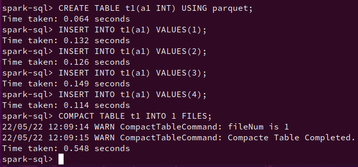

# Spark SQL Homework - Implement Compact Table command

參考零期的作業當練習 https://xie.infoq.cn/article/04ced2244b37dbf7d0631970d

[github commit](https://github.com/Julian-Chu/spark/commit/5076bd8b51797e12b1d51d161965c125c8729656)
1. 修改 sql/catalyst/src/main/antlr4/org/apache/spark/sql/catalyst/parser/SqlBase.g4
2. 執行 maven -> Spark Project Catalyst -> Plugins -> antlr4
3. 新增 scala code
4. 編譯命令： `build/mvn clean package -DskipTests -Phive -Phive-thriftservr`



## 改進空間
```scala
    val tmpTableName = table.identifier + "_tmp"
    dataDF.write.mode(SaveMode.Overwrite).saveAsTable(tmpTableName)
    spark.table(tmpTableName)
      .repartition(num).write.mode(SaveMode.Overwrite).saveAsTable(table.identifier)
    spark.sql(s"drop table if exists $tmpTableName")
    log.warn("Compacte Table Completed.")
    Seq()
```
- ~~閱讀 spark-sql API doc, 後發現如果只需要減少 files , 則可將目前版本的使用的 repartition() 改成 coalesce(), 有機會可以得到較好的 performance~~ 更正, coalesce(n), n 不為1 的情況可能有性能問題
- saveAsTable 會存儲成 persistent table,  可以嘗試 使用 createOrReplaceTempView, 減少寫入的動作
- todo: 如何在 spark-sql shell 取得 file size?